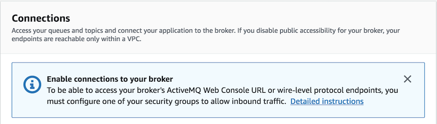

# Building efficient and scalable distributed applications using Amazon MQ

This is a companion source code for AWS Blog <Link to the blog>

## CloudFormation Templates & Supporting Resources

| Template                         | Purpose|
|----------------------------------| -------------- |
| [CF_Template_AmazonMQBroker.yaml](./src/main/resources/cloudformation-scripts/CF_Template_AmazonMQBroker.yaml) |Sample template to provision Amazon MQ broker |
| [broker-config-sample.xml](./src/main/resources/broker-config-sample.xml) |Sample Broker Configuration File |

## Setup Instructions

1. Clone or download this source code
1. Import the source code to Eclipse or IntelliJ IDEA as a Maven project
1. Build the project using Maven commands
1. This will generate a jar file with name **amazon-mq-fifo-starter-kit-1.0.jar**
1. Provision Amazon MQ Broker using [CF_Template_AmazonMQBroker.yaml](./src/main/resources/cloudformation-scripts/CF_Template_AmazonMQBroker.yaml)

   **Note:** To make the set up easy, you can provision the broker in a public subnet with a security group that has inbound access from your Laptop / EC2 instance.
 For production deployments, check the following resources:

   - [Using Amazon MQ Securely](https://docs.aws.amazon.com/amazon-mq/latest/developer-guide/using-amazon-mq-securely.html).
   - [Accessing the ActiveMQ Web Console of a Broker without Public Accessibility](https://docs.aws.amazon.com/amazon-mq/latest/developer-guide/accessing-web-console-of-broker-without-private-accessibility.html).

1. Optionally, you can use AWS Management Console to provision broker by following this [AWS Blog](https://aws.amazon.com/blogs/aws/amazon-mq-managed-message-broker-service-for-activemq/)

1. From AWS Management Console, go to Amazon MQ, select the broker, and make a note of the below values. You will need them to access Broker console and run the PoC.
   1. ActiveMQ Web Console URL
   2. OpenWire Endpoint URL

1. Configure Security Group from Broker details section on AWS Console as shown in the below screenshot.
  

## Running the Starter Kit from IDE locally

1. Find out the Public IP address of your system and follow **step # 8** of [Setup Instructions](#setup-instructions)
1. Run the program **AmazonMQPoC_TestRunner** with the following program arguments separated by a space
   1. Amazon MQ OpenWire Endpoint URL
   1. Amazon MQ username
   1. Amazon MQ password
   1. Number of messages to be inserted per producer

## Running the Starter Kit from Command-line on your Laptop

1. Go to the folder **/Amazonmqpoc/target** and run the jar file. 

   ```bash
   java -jar amazon-mq-fifo-starter-kit-1.0.jar \
   Replace_this_with_OpenWire_Endpoint_URL \
   Replace_this_with_AmazonMQ_UserName \
   Replace_this_with_AmazonMQ_Password \
   5000
   ```

## Running the Starter Kit from an EC2 Instance

1. Launch an EC2 instance with an IAM role that has read and write permission on DynamoDB.
1. Take the Private IP address of your EC2 instance and follow **step # 8** of [Setup Instructions](#setup-instructions)
1. Log on to EC2 instance and do the following:

    ```bash
    sudo yum -y install java-1.8.0-openjdk.x86_64
    mkdir amazon-mq-starter-kit
    cd amazon-mq-starter-kit/
    ```

1. Copy the Jar file **amazon-mq-fifo-starter-kit-1.0.jar** from your Laptop to EC2 instance using secure copy (SCP) or PuTTY:

   1. An example SCP command is below:

       ```bash
       scp -i my_ec2_keypair.pem amazon-mq-fifo-starter-kit-1.0.jar 
       ec2-user@IP_Address_of_EC2:/home/ec2-user/amazon-mq-starter-kit
       ```

   1. To use PuTTY, refer [Connecting to Your Linux Instance from Windows Using PuTTY](https://docs.aws.amazon.com/AWSEC2/latest/UserGuide/putty.html).

1. Run the Java Application

   ```bash
   java -jar amazon-mq-fifo-starter-kit-1.0.jar \
   Replace_this_with_OpenWire_Endpoint_URL \
   Replace_this_with_AmazonMQ_UserName \
   Replace_this_with_AmazonMQ_Password \
   5000
   ```
  
1. The above step generates message metrics in CSV files. Use the following command to import them back to your Laptop for analysis.

    ```bash
    scp -i /The_Path_To/my_ec2_keypair.pem ec2-user@IP_Address_of_EC2:/home/ec2-user/amazon-mq-starter-kit/*.csv .
    ```

## ActiveMQ Web Console

You can access ActiveMQ Web Console to analyze queues and message statistics. The credentials for the Console are same as what you provided during broker setup.

## Source code Summary

### FIFO Test Case 1 to 5. Producers and Consumers operated at the same time. All consumers started at the same time

| Test Case Description                                             | Java Class |
|-------------------------------------------------------------- | -------------- |
| The driver program to execute all test cases| [AmazonMQFIFOStarterKit](./src/main/java/com/aws/amazonmq/blog/runner/AmazonMQFIFOStarterKit.java) |
| Queue with 3 producers, 3 message groups, 1 consumer  | [FIFO_Testcase_1](./src/main/java/com/aws/amazonmq/blog/testcases/FIFO_Testcase_1.java) |
| Queue with 3 producers, 3 message groups, 2 consumers | [FIFO_Testcase_2](./src/main/java/com/aws/amazonmq/blog/testcases/FIFO_Testcase_2.java) |
| Queue with 3 producers, 3 message groups, 3 consumers | [FIFO_Testcase_3](./src/main/java/com/aws/amazonmq/blog/testcases/FIFO_Testcase_3.java) |
| Queue with 3 producers, 3 message groups, 4 consumers | [FIFO_Testcase_4](./src/main/java/com/aws/amazonmq/blog/testcases/FIFO_Testcase_4.java) |
| Queue with 4 producers, 4 message groups, 3 consumers | [FIFO_Testcase_5](./src/main/java/com/aws/amazonmq/blog/testcases/FIFO_Testcase_5.java) |

### FIFO Test Case 6 - Producers and Consumers operated at the same time. One of the three consumers started first

| Test Case Description                                             | Java Class |
|-------------------------------------------------------------- | --------------   |
| Queue with 3 producers, 3 message groups, 3 consumers  | [FIFO_Testcase_6](./src/main/java/com/aws/amazonmq/blog/testcases/FIFO_Testcase_6.java) |

### FIFO Test Case 7 - Demonstrated message distribution improvement by closing message groups explicitly

| Test Case Description                                             | Java Class |
|-------------------------------------------------------------- | --------------   |
| Queue with 3 producers, 3 message groups, 3 consumers  | [FIFO_Testcase_7](./src/main/java/com/aws/amazonmq/blog/testcases/FIFO_Testcase_7.java) |

### FIFO Test Case 8 - Demonstrated message distribution improvement by closing consumer session and restarting

| Test Case Description                                             | Java Class |
|-------------------------------------------------------------- | -------------- |
| Queue with 3 producers, 3 message groups, 3 consumers | [FIFO_Testcase_8](./src/main/java/com/aws/amazonmq/blog/testcases/FIFO_Testcase_8.java) |

## Tags

Amazon MQ, Enterprise Messaging, Queues, FIFO, Message Ordering

## License Summary

This sample code is made available under the MIT license. See the LICENSE file.
